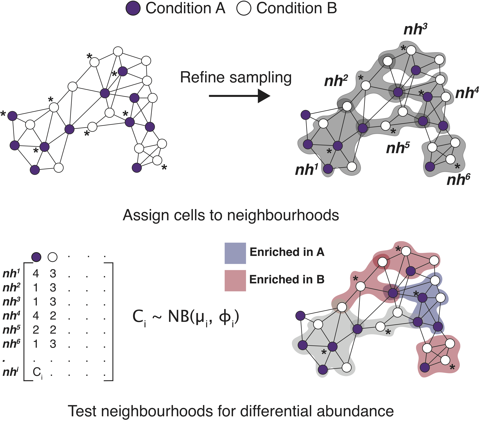

# miloR
_Milo_ is a method for differential abundance analysis on KNN graph from single-cell datasets. For more details, read [our manuscript](https://doi.org/10.1038/s41587-021-01033-z). If you use Milo in your study, please cite _Dann, E., Henderson, N.C., Teichmann, S.A. et al. Differential abundance testing on single-cell data using k-nearest neighbor graphs. Nat Biotechnol (2021)._

<p align="center">
  
</p>

[](https://travis-ci.com/MarioniLab/miloR)
[](https://codecov.io/gh/MarioniLab/miloR)
[](https://github.com/MarioniLab/miloR/actions/workflows/RCMD_check.yml)

### Installation

```
## Milo is available from Bioconductor (preferred stable installation)
if (!requireNamespace("BiocManager", quietly = TRUE))
    install.packages("BiocManager")

BiocManager::install("miloR")

## Install development version
devtools::install_github("MarioniLab/miloR", ref="devel") 
```

### Tutorials

1. [Basic Milo example on simulated dataset](https://rawcdn.githack.com/MarioniLab/miloR/3646391023f600bae00efd9d940b888503d7a536/docs/articles/milo_demo.html)
2. [Milo example on mouse gastrulation dataset](https://rawcdn.githack.com/MarioniLab/miloR/7c7f906b94a73e62e36e095ddb3e3567b414144e/vignettes/milo_gastrulation.html#5_Finding_markers_of_DA_populations): this includes a demo for downstream analysis functions.
3. [Integrating miloR in scanpy/anndata workflow](https://github.com/MarioniLab/milo_analysis_2020/blob/main/notebooks/milo_in_python.ipynb) (see also [`milopy`](https://github.com/emdann/milopy) for a full workflow in python)
4. [Specifying contrasts of interest for differential abundance testing with Milo](https://bioconductor.org/packages/release/bioc/vignettes/miloR/inst/doc/milo_contrasts.html)

### Example work flow
An example of the `Milo` work flow to get started:

```{r}
data(sim_trajectory)
milo.meta <- sim_trajectory$meta
milo.obj <- Milo(sim_trajectory$SCE)
milo.obj
```

Build a graph and neighbourhoods.

```{r}
milo.obj <- buildGraph(milo.obj, k=20, d=30)
milo.obj <- makeNhoods(milo.obj, k=20, d=30, refined=TRUE, prop=0.2)
```

Calculate distances, count cells according to an experimental design and perform DA testing.

```{r}
milo.obj <- calcNhoodDistance(milo.obj, d=30)
milo.obj <- countCells(milo.obj, samples="Sample", meta.data=milo.meta)

milo.design <- as.data.frame(xtabs(~ Condition + Sample, data=milo.meta))
milo.design <- milo.design[milo.design$Freq > 0, ]
rownames(milo.design) <- milo.design$Sample
milo.design <- milo.design[colnames(nhoodCounts(milo.obj)),]

milo.res <- testNhoods(milo.obj, design=~Condition, design.df=milo.design)
head(milo.res)
```

### Support

For any question, feature request or bug report please create a new issue in this repository.

### Contributions

We welcome contributions and suggestions from the community (though we may not take them onboard if they don't align with our development roadmap - please 
don't be offended). Please submit the initial idea as an issue, which we will discuss and ask for refinements/clarifications. If we approve the idea, then 
please open a pull request onto the __devel__ branch, from which we will begin a review process. To smooth the process, please note that code changes must be 
backwards compatible, and must include all relevant unit tests.
